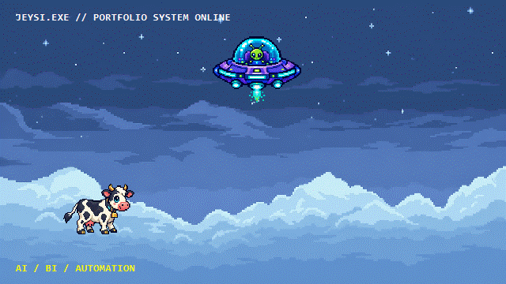

<div align="center">

# `JEYSI.EXE // DEV ARCADE`



### `PLAYER 01: JOHN CARLO MANALO`

**Full Stack Dev • AI/LLM & OCR • RAG Pipeline • Enterprise Automation • Power BI**

<a href="https://mochines20.github.io/">
  
</a>

<a href="mailto:johncarlomanalo165@gmail.com">
  
</a>

</div>

```text
╔══════════════════════════════════════════════════════════════════════╗
║  MISSION LOG                                                        ║
║  STATUS   : ONLINE                                                  ║
║  LOADOUT  : AI / BI / AUTOMATION                                    ║
║  OBJECTIVE: Build useful systems that solve real business problems. ║
╚══════════════════════════════════════════════════════════════════════╝
```

## `CARTRIDGE SELECT // FEATURED BUILDS`

| Build | Mission Brief |
| --- | --- |
| **AI-Powered Invoice Automation** | OCR extraction, validation, approval routing, SFTP transfer, and accounting integrations. |
| **Power BI Brand Analytics** | Executive dashboards for brand analytics, comparisons, and strategic reporting. |
| **Enterprise Costing Workflow** | Guided validation, multi-tier approvals, audit logging, and RAG-powered historical costing. |
| **ITSM Ticketing & Reporting** | Incident and service-request tracking, SLA monitoring, and IT performance reporting. |

## `SKILL TREE`

`Python` `JavaScript` `TypeScript` `React` `Node.js` `PostgreSQL` `MySQL`
`OCR` `AI / LLM` `RAG` `Power BI` `Power Automate` `Supabase` `Azure` `Git`

## `PLAYER PROFILE`

I’m an Associate Software Engineer and Information Technology graduate specializing in business analytics, full-stack enterprise systems, AI/OCR automation, RAG solutions, and Power BI dashboards. I build practical systems across business analysis, frontend and backend development, API integration, database architecture, DevOps, QA, and post-launch support.

## `CONNECT // LAUNCH PAD`

- **Portfolio:** [mochines20.github.io](https://mochines20.github.io/)
- **Email:** [johncarlomanalo165@gmail.com](mailto:johncarlomanalo165@gmail.com)
- **LinkedIn:** [Connect with John Carlo](https://www.linkedin.com/)

<div align="center">

`WORLD STATUS: READY // NO COINS REQUIRED`

</div>
